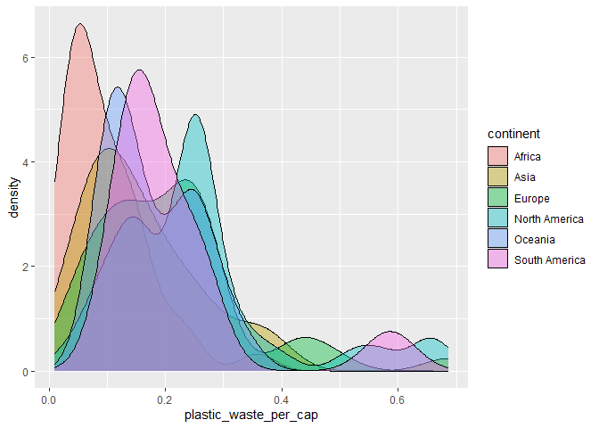
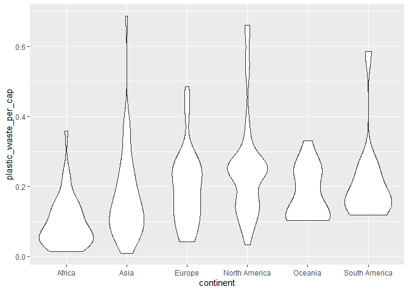
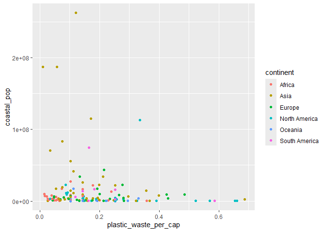

Lab 02 - Plastic waste
================
Malaurie Audet
22 septembre

## Chargement des packages et des données

``` r
library(tidyverse) 
```

``` r
plastic_waste <- read_csv("data/plastic-waste.csv")
```

Commençons par filtrer les données pour retirer le point représenté par
Trinité et Tobago (TTO) qui est un outlier.

``` r
plastic_waste <- plastic_waste %>%
  filter(plastic_waste_per_cap < 3.5)
```

## Exercices

### Exercise 1

``` r
ggplot(data = plastic_waste, aes(x = plastic_waste_per_cap)) +
  geom_histogram(binwidth = 0.2)+
  facet_grid(.~continent)
```

<!-- -->

``` r
plastic_waste <- plastic_waste %>%
  filter(plastic_waste_per_cap < 3.5)
```

On peut dire que l’Afrique et l’Asie ont un plus faible taux de déchets
plastiques par habitants, qui ce situe majoritairement entre 0 et 0,1.
L’Europe, l’Amérique du Nord et l’Océanie ont plutot des taux entre
0,125 et 0,25. L’Amérique du Sud à aussi un taux entre 0,125 et 0,25,
cependant, il y en a beaucoup moins.

### Exercise 2

``` r
ggplot(data = plastic_waste, aes(x = plastic_waste_per_cap,fill=continent)) +
  geom_density(alpha=0.4)
```

<!-- -->

Le reglage de la couleur est dans aes() puisque les paramètres doivent
être associé à des données, par example, les données de chaque
continents ont été associé à une certaines couleurs. Dans le cas
d’alpha, ceci contrôle la transparence de tout les continents,ça ne
doit, donc pas être liéé au données.

### Exercise 3

Boxplot:

``` r
ggplot(data = plastic_waste, aes(y = plastic_waste_per_cap,x=continent)) +
  geom_boxplot()
```

<!-- -->

Violin plot:

``` r
ggplot(data = plastic_waste, aes(y = plastic_waste_per_cap,x=continent)) +
  geom_violin()
```

<!-- -->

Les violin plots donnent une meilleure représentation de données grâce
aux différentes épaisseurs tout au long du violon. Les boxplot montrés
plutôt où la majorité se situe, mais moins précisément.

### Exercise 4

``` r
ggplot(data = plastic_waste, aes(x = plastic_waste_per_cap,y=mismanaged_plastic_waste_per_cap,color=continent)) +
  geom_point()
```

<!-- -->

On peut voir qu’il y a une relation positive mais non linéaire, car
lorsqu’un continent augmente selon une variable il y a aussi une
augmentation selon l’autre variable. Cependant, on peut voir que chaque
continent suis une tendance differente, par exemple, l’Afrique, l’Asie
et l’Océanie on une quantité de déchets non gérés significativement plus
élevé en fonction des déchets totaux. On peut voir que même lorsque les
déchets augmente en Amérique du Nord et l’Europe,leur déchets non gérés
ne monte pas aussi rapidement qu’en Afrique, Asie et Océanie.

### Exercise 5

``` r
ggplot(data = plastic_waste, aes(x = plastic_waste_per_cap,y=total_pop)) +
  geom_point()
```

    ## Warning: Removed 10 rows containing missing values or values outside the scale range
    ## (`geom_point()`).

<!-- -->

``` r
ggplot(data = plastic_waste, aes(x = plastic_waste_per_cap,y=coastal_pop)) +
  geom_point()
```

<!-- -->

Dans les deux graphiques les données sont quand mêmes très similaire en
x, cependant, on peut voir que les y monte beaucoup plus haut, ceci
montre que peut importe là taille de la population la relation sera
assez similaire.

## Conclusion

Recréez la visualisation:

``` r
plastic_waste_coastal <- plastic_waste %>% 
  mutate(coastal_pop_prop = coastal_pop / total_pop) %>%
  filter(plastic_waste_per_cap < 3)
ggplot(data = plastic_waste, aes(x = plastic_waste_per_cap,y=coastal_pop,color=continent)) +
  geom_point()
```

<!-- -->

``` r
  labs(title="Quantité de déchets plastiques vs Proportion de la population côtière",continent="Continent",x="Proportion de la population côtière(Coastal/total population)",y="Nombre de déchets plastiques par habitant",subtitle="Selon le continent")
```

    ## $continent
    ## [1] "Continent"
    ## 
    ## $x
    ## [1] "Proportion de la population côtière(Coastal/total population)"
    ## 
    ## $y
    ## [1] "Nombre de déchets plastiques par habitant"
    ## 
    ## $title
    ## [1] "Quantité de déchets plastiques vs Proportion de la population côtière"
    ## 
    ## $subtitle
    ## [1] "Selon le continent"
    ## 
    ## attr(,"class")
    ## [1] "labels"
